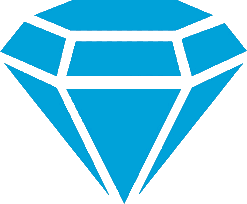

Gemstone
========
Gemstone is a high level Python 3 game engine designed around the Panda3D game engine.


## Dependencies
Gemstone's dependencies break down into two categories. Required and optional. Gemstone will function normally without all the optional dependencies present. However certain features will be unavailable.

### Required
* Python 3
* Panda3D
* PyQt5 (Editor only)

### Optional
* watchdog
* limeade
* playfab

## Install
To install the latest Gemstone framework run the following commands from your development root folder. 

```bash
git clone https://github.com/thetestgame/panda3d-gemstone
cd panda3d-gemstone
python setup.py install
```